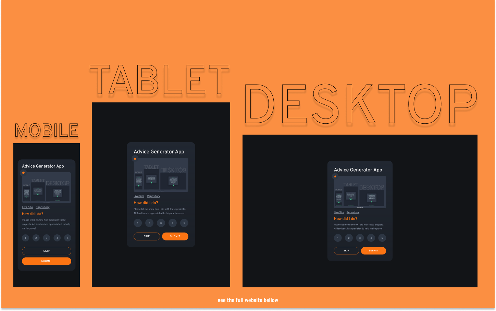

# Frontend Mentor - Interactive Rating Component Solution

This is a solution to the [Interactive Rating Component Challenge on Frontend Mentor](https://www.frontendmentor.io/challenges/interactive-rating-component-koxpeBUmI).

## Table of contents

- [Overview](#overview)
  - [The challenge](#the-challenge)
  - [Screenshot](#screenshot)
  - [Links](#links)
- [My process](#my-process)
  - [Built with](#built-with)
  - [What I learned](#what-i-learned)
  - [Continued development](#continued-development)
  - [Useful resources](#useful-resources)
- [Author's Links](#authors-links)

## Overview

### The challenge

Users should be able to:

- View the optimal layout for the app depending on their device's screen size
- See hover states for all interactive elements on the page
- Select and submit a number rating
- See the "Thank you" card state after submitting a rating

### Screenshot

### Links

- Live Site URL: [https://kens-visuals.github.io/interactive-rating-component/](https://kens-visuals.github.io/interactive-rating-component/)
- Solution URL: [https://www.frontendmentor.io/solutions/interactive-rating-component-solution-built-with-react-and-tailwindcss-B19iTMpG9](https://www.frontendmentor.io/solutions/interactive-rating-component-solution-built-with-react-and-tailwindcss-B19iTMpG9)

## My process

### Built with

- React
- TailwindCSS
- Semantic HTML5 markup
- CSS Flexbox
- CSS Grid
- Mobile-first workflow

### What I learned

This was my first challenge completed with Tailwind CSS. As most of the people, at the beginning, I was skeptical about Tailwind CSS, but after playing with it for a while I decided to give it a try in one of the challenges. Since this was I small challenge, I decided to add a bit more functionality, so I created a data.json file and included some of my previous projects, their screenshots, links to live website and repository. I think it came out pretty cool. And yes I liked Tailwind CSS, I'm planning on using it on a bigger project.

### Continued development

I want to focus more on `tailwind.config.js` file to make things more reusable and also add more custom sizes.

## Author's Links

- Medium - [@kens_visuals](https://medium.com/@kens_visuals)
- CodePen - [@kens-visuals](https://codepen.io/kens-visuals)
- Codewars - [@kens_visuals](https://www.codewars.com/users/kens_visuals)
- Frontend Mentor - [@kens-visuals](https://www.frontendmentor.io/profile/kens-visuals)
